# Distributed RAG Document Synthesis Platform

An asynchronous, containerized Retrieval-Augmented Generation (RAG) backend designed to automate the ingestion, chunking, and semantic synthesis of uploaded documents without blocking the main application thread.



## Core Engineering Problem
Processing large documents with LLMs introduces significant latency. A synchronous API would quickly time out or exhaust worker threads under concurrent load. This architecture decouples data ingestion from vector retrieval, ensuring the API remains highly responsive while offloading complex embedding tasks.

## System Architecture & Trade-offs

* **Vector Search Engine (Qdrant):** Selected over in-memory indexes (like FAISS) for production-grade latency and persistence. Qdrant handles high-dimensional similarity searches via an HNSW graph.
* **Object Storage (MinIO):** Decouples raw file storage from the main database. MinIO provides an S3-compatible API, allowing horizontal scaling of file blobs independent of relational metadata.
* **Data Orchestration (LlamaIndex):** Handles document parsing, chunking strategy, and embedding pipeline prior to Qdrant insertion.
* **State Management (SQLite -> PostgreSQL):** Currently utilizing SQLite for MVP metadata storage. The schema and ORM are designed for a zero-friction migration to PostgreSQL to support distributed, concurrent write scaling.

## Data Flow
1.  **Ingestion:** Client uploads PDF/Text -> FastAPI stores raw file in MinIO.
2.  **Processing:** LlamaIndex extracts text, chunks data, and generates embeddings.
3.  **Storage:** Vectors pushed to Qdrant; metadata written to SQLite.
4.  **Retrieval:** Client queries system -> K-NN search on Qdrant -> LLM synthesizes response based on localized context.

## Local Deployment
```bash
# Deploys the entire stack (MinIO, Qdrant, API, Frontend)
docker-compose up --build -d
```